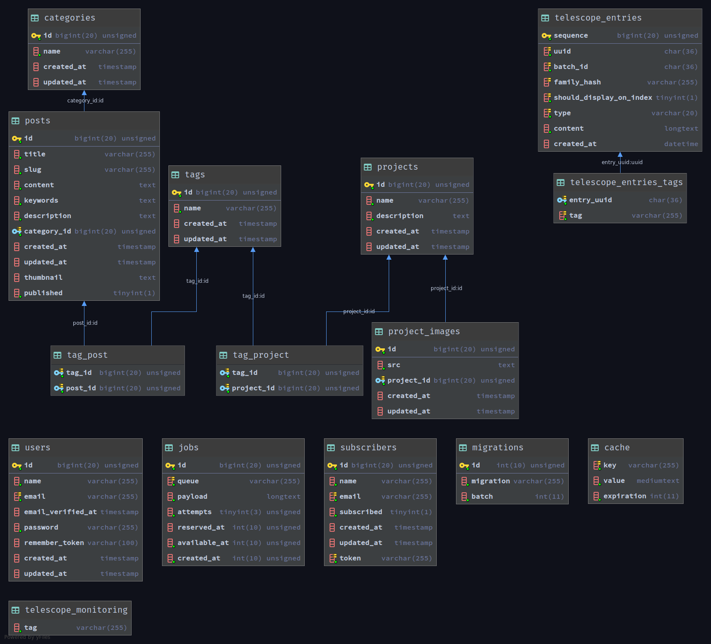

## Laravel simple Blog / Portfolio application
This project is built for a simple blog and portfolio usage while recording for a YouTube series.

YouTube PLAYLIST: [Laravel Blog / Portfolio simple application](https://www.youtube.com/watch?v=IGUshKFKNLQ&list=PLRoT2Wf8XDsA8ewvR0ncaS3cbtzUfYBir)
YouTube CHANNEL: [ProgrammingWithPeter](https://youtube.com/programmingwithpeter)

## Installation
- Clone this repository:
`git clone git@github.com:mp27/laravel-blog-portfolio.git`
- Run composer install on the project directory: `composer install`
- Run npm install on the project directory: `npm install`
- Copy `.env.example` to `.env` and add your credentials for mail, database, Algolia search
- Run migrations with user seeder(don't forget to add admin credentials on .env): `php artisan migrate --seed`
- Create the following folders on public directory: `images`, `thumbnails`, `projects`
- Run server with `php artisan serve` command or your preferred way
- Go to `/admin` route and create categories, tags, posts and projects
- On deploy, you need to configure a cronjob for schedules and `php artisan queue:work` command to run on background
- Have fun!

## DB Schema

## License

This project is under [MIT license](https://opensource.org/licenses/MIT).
